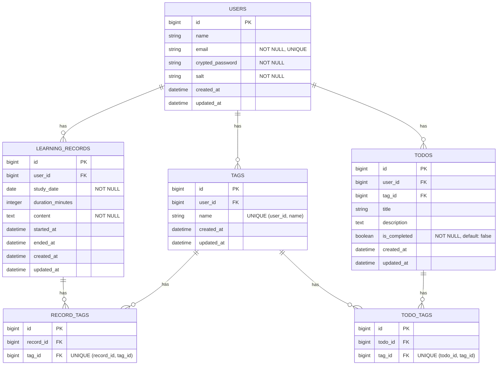

# [卒制](https://github.com/QynToKey/HowLongWillItLast) (day 9)：Tag 構成へリファクタリング

---

## 0️⃣ 前提

- 現行設計では LearningTheme が主役になっており、本来の主役として想定している **LearningRecord はこれに従属する**関係になっている。

```text
users
 └ learning_themes
     ├ learning_records
     └ todos
```

- ユーザーが LearningRecord を記録する際、現行設計では LearningTheme によってデータを管理する現行設計は**カテゴリを固定してしまう**ため、日々の記録作業の制約になりかねない。

⬇️ *以上を勘案し、Tag 構造へのリファクタリングを行うこととする*

```text
users
 └ learning_records
       └ record_tags
             └ tags
```

---

1️⃣ テーブル設計に「中間テーブル」を追加

- `README.md`

```markdown
#### Eテーブル：record_tags

※ learning_records と tags の多対多関係を管理する中間テーブル

- `record_id` : bigint / learning_recordsテーブルの外部キー
- `tag_id` : bigint / tagsテーブルの外部キー

#### Fテーブル：todo_tags

※ todos と tags の多対多関係を管理する中間テーブル

- `todo_id` : bigint / todosテーブルの外部キー
- `tag_id` : bigint / tagsテーブルの外部キー
'''

- `docs/er_diagram.md`


