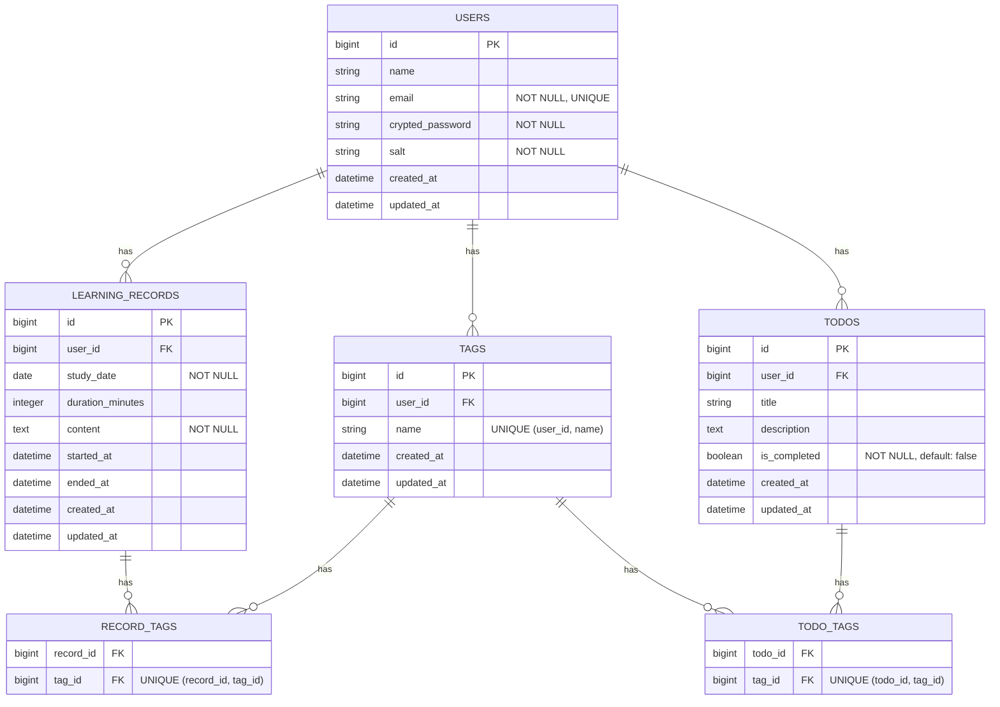

# [卒制](https://github.com/QynToKey/HowLongWillItLast) (day 9)：Tag 構成へリファクタリング

---

## 設計変更の理由

- 当初設計では、本来の主軸データとして想定してい `LearningRecord` が `LearningTheme` に従属する関係になっている。

```bash
# 当初設計
users
 └ learning_themes
     ├ learning_records
     └ todos
```

- 当初設計は `LearningTheme` がカテゴリを固定してしまうため、ユーザーが日々の `LearningRecord` を記録する際の制約になりかねないと判断し、より柔軟なデータ分類を可能にするため `Tag` による多対多構造へ設計変更することとした。

⬇️ *以上を勘案し、Tag 構造へのリファクタリングを行うこととする*

```bash
# リファクタリング後
users
 └ learning_records
       └ record_tags
             └ tags
```

---

1️⃣ テーブル設計に「中間テーブル」を追加

- `README.md`

```markdown
#### Eテーブル：record_tags

※ learning_records と tags の多対多関係を管理する中間テーブル

- `record_id` : bigint / learning_recordsテーブルの外部キー
- `tag_id` : bigint / tagsテーブルの外部キー

#### Fテーブル：todo_tags

※ todos と tags の多対多関係を管理する中間テーブル

- `todo_id` : bigint / todosテーブルの外部キー
- `tag_id` : bigint / tagsテーブルの外部キー
```

- `docs/er_diagram.md`

```markdown
### 正規化について

本設計は第3正規形（3NF）を満たすことを意識している。

- 第1正規形
  繰り返し属性を排除するため、`learning_records` と `tags` の多対多関係を
  中間テーブル `record_tags` に分離した。

- 第2正規形
  主キーまたは複合キーに対して、
  非キー属性が完全関数従属するよう設計している。

  中間テーブル（record_tags / todo_tags）は
  非キー属性を持たないため問題は発生しない。

- 第3正規形
  非キー属性が他の非キー属性に依存する推移的依存を排除している。
  例えば、`tags` や `users` の情報を `learning_records` に重複保持していない。
```



---

## Learning_Theme の削除

### 1️⃣ Learning_Themes テーブルのデータを削除

- Railsコンソールをひらく

```bash
docker compose exec web rails c
```

⬇️

- 現在のデータを確認

```bash
>> LearningTheme.all
```

⬇️

- 問題なければデータを削除

```bash
>> LearningTheme.destroy_all
```

⬇️

- 削除を確認

```bash
> LearningTheme.count
  LearningTheme Count (8.8ms)  SELECT COUNT(*) FROM "learning_themes"
=> 0
```

### 2️⃣ Learning_Themes テーブルを削除

- マイグレーション

```bash
$ docker compose exec web rails g migration DropLearningThemes
      invoke  active_record
      create    db/migrate/20260306091440_drop_learning_themes.rb
```

⬇️

- 生成された migration を編集

```ruby
class DropLearningThemes < ActiveRecord::Migration[7.2]
  def change
    drop_table :learning_themes
  end
end
```

⬇️

- migration 実行

```bash
$ docker compose exec web rails db:migrate
== 20260306091440 DropLearningThemes: migrating ===============================
-- drop_table(:learning_themes)
   -> 0.0139s
== 20260306091440 DropLearningThemes: migrated (0.0139s) ======================
```

⬇️

- テーブル削除を確認

```bash
how-long-will-it-last(dev)> ActiveRecord::Base.connection.tables
=> ["schema_migrations", "ar_internal_metadata", "users"]
```

👉 *`learning_themes` が存在しなければ削除成功*

⬇️

- モデルを削除

```bash
rm app/models/learning_theme.rb
rm app/controllers/learning_themes_controller.rb
rm -r app/views/learning_themes
rm app/helpers/learning_themes_helper.rb
rm test/models/learning_theme_test.rb
```

⬇️

- 最終チェック

```bash
grep -R "LearningTheme" .
```

👉 *以下だけが残っている状態なら削除成功*

```</>
db/migrate/...
log/...
.git/...
tmp/...
```

---
