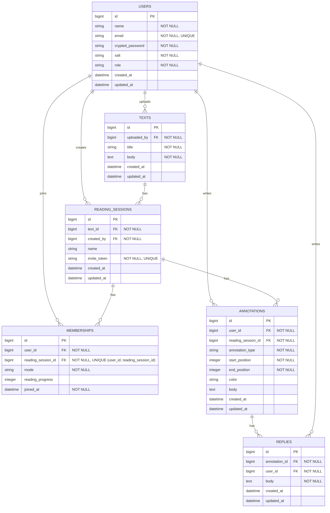

# [co-READER](https://github.com/QynToKey/co_reader)（day: 2）： ER図

## 概要

- 6エンティティ： `users` / `texts` / `reading_sessions` / `memberships` / `annotations` / `replies`
- 孤読・共読のモードは `memberships.mode` で管理（セッション単位ではなく参加者単位）
- 書き込み3種別（ハイライト・アンダーライン・コメント）は `annotations` に統一し、`annotation_type` で区別
- テキスト位置は `start_position` / `end_position`（文字オフセット）で管理

---

## ER 図

