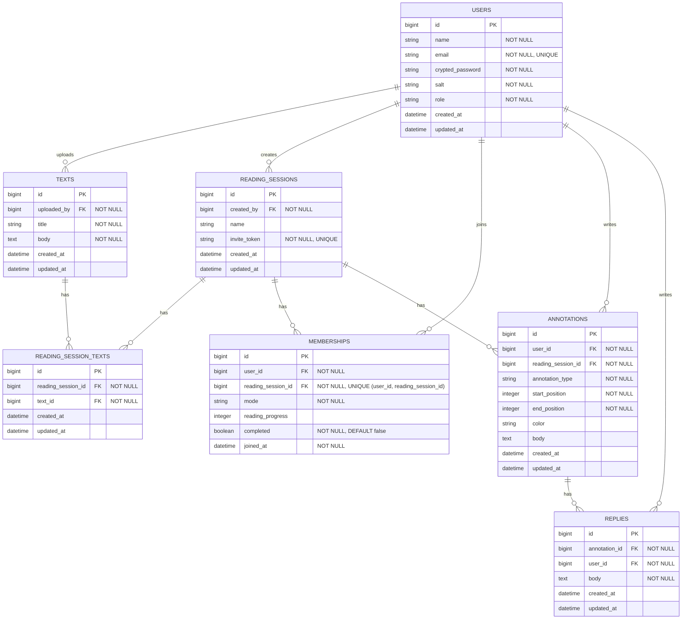

# [co-READER](https://github.com/QynToKey/co_reader)（day: 13）： 複数テキストに対応

## 0️⃣ 現状と実装方針

> 現状

- `reading_sessions.text_id`（単一 FK）で「1 セッション = 1 テキスト」になっている。

> 実装方針

- 1 セッションに複数の `Text` を紐づけるため、`reading_session_texts` 中間テーブルを追加し `text_id` を削除する。
- スキーマ変更により既存コードが 2 箇所で壊れるため、最小限の修正も合わせて行う。

---

## 1️⃣ *`reading_sessions` テーブルから `text_id` カラムを削除

```bash
$ docker compose exec web bin/rails g migration RefactorReadingSessionTexts
      invoke  active_record
      create    db/migrate/20260420035501_refactor_reading_session_texts.rb
```

  ⬇️

```ruby
# db/migrate/20260420035501_refactor_reading_session_texts.rb
class RefactorReadingSessionTexts < ActiveRecord::Migration[8.1]

  # up: reading_session_textsテーブルを作成 → 既存のデータを新しいテーブルに移行 →reading_sessionsテーブルからtext_idカラムを削除
  def up
    create_table :reading_session_texts do |t|
      t.references :reading_session, null: false, foreign_key: true
      t.references :text, null: false, foreign_key: true
      t.timestamps
    end

    # reading_session_idとtext_idの組み合わせが一意であることを保証するためのインデックスを追加
    add_index :reading_session_texts, [:reading_session_id, :text_id], unique: true

    # 既存のデータを新しいテーブルに移行
    execute <<-SQL
      INSERT INTO reading_session_texts (reading_session_id, text_id, created_at, updated_at)
      SELECT id, text_id, NOW(), NOW() FROM reading_sessions
      WHERE text_id IS NOT NULL
    SQL

    # reading_sessionsテーブルからtext_idカラムを削除
    remove_reference :reading_sessions, :text, foreign_key: true
  end

  # down: reading_sessionsテーブルにtext_idカラムを再度追加 → reading_session_textsテーブルからデータを移行 → reading_session_textsテーブルを削除
  def down
    add_reference :reading_sessions, :text, foreign_key: true

    # 既存のデータを新しいテーブルから移行
    execute <<-SQL
      UPDATE reading_sessions rs
      SET text_id = (
        SELECT text_id FROM reading_session_texts
        WHERE reading_session_id = rs.id
        LIMIT 1
      )
    SQL

    # 最後に、reading_session_textsテーブルを削除
    drop_table :reading_session_texts
  end
end
```

  ⬇️

```bash
$ docker compose exec web bin/rails db:migrate
== 20260420035501 RefactorReadingSessionTexts: migrating ======================
-- create_table(:reading_session_texts)
   -> 0.0432s
-- add_index(:reading_session_texts, [:reading_session_id, :text_id], {:unique=>true})
   -> 0.0031s
-- execute("      INSERT INTO reading_session_texts (reading_session_id, text_id, created_at, updated_at)\n      SELECT id, text_id, NOW(), NOW() FROM reading_sessions\n      WHERE text_id IS NOT NULL\n")
   -> 0.0068s
-- remove_reference(:reading_sessions, :text, {:foreign_key=>true})
   -> 0.0204s
== 20260420035501 RefactorReadingSessionTexts: migrated (0.0739s) =============

---

## 2️⃣ 中間テーブル `reading_session_texts` を作成

```bash
touch app/models/reading_session_text.rb
```

```ruby
# app/models/reading_session_text.rb
class ReadingSessionText < ApplicationRecord
  # reading_sessions テーブルと texts テーブルの中間テーブル
  belongs_to :reading_session
  belongs_to :text
end
```

---

## 3️⃣ `ReadingSession` / `Text` モデルを複数テキスト対応に修正

```ruby
# app/models/reading_session.rb

 class ReadingSession < ApplicationRecord
-  belongs_to :text
   belongs_to :creator, class_name: "User", foreign_key: :created_by_id
+  has_many :reading_session_texts, dependent: :destroy
+  has_many :texts, through: :reading_session_texts
   has_many :memberships, dependent: :destroy
   has_many :users, through: :memberships

   validates :invite_token, presence: true, uniqueness: true
-  validates :text, presence: true
   validates :creator, presence: true
```

```ruby
# app/models/text.rb

 class Text < ApplicationRecord
   belongs_to :uploader, class_name: "User", foreign_key: :uploaded_by
+  has_many :reading_session_texts, dependent: :destroy
+  has_many :reading_sessions, through: :reading_session_texts
   validates :title, presence: true
   validates :body, presence: true
 end
```

---

## 4️⃣ `ReadingSessions` コントローラーのパスを修正

```ruby
# app/controllers/reading_sessions_controller.rb

   def index
-    @memberships = current_user.memberships.includes(reading_session: :text).order(created_at: :desc)
+    @memberships = current_user.memberships.includes(reading_session: :texts).order(created_at: :desc)
   end

   ・・・

   def join
    ・・・
-    redirect_to text_path(session.text), notice: "すでに参加しています"
+    redirect_to reading_sessions_path, notice: "すでに参加しています"

-    redirect_to text_path(session.text), notice: "セッションに参加しました"
+    redirect_to reading_sessions_path, notice: "セッションに参加しました"
  end
end
```

👉 *`join` の redirect 先は #83（テキスト一覧ページ）実装後に更新*

---

## 5️⃣ 「セッション一覧」ページのリンクを修正

👉 *#83（テキスト一覧ページ）実装までの一時的な退避措置*

```erb
-          <%= link_to membership.reading_session.name, text_path(membership.reading_session.text) %>
+          <%= membership.reading_session.name %>
```

---

## 7️⃣ ER 図を更新

1. `READING_SESSIONS` エンティティから `text_id` を削除
2. `READING_SESSION_TEXTS` エンティティを追加
3. リレーションを修正
4. 制約設計を修正



---

### 総学習時間： 1225.0 時間
