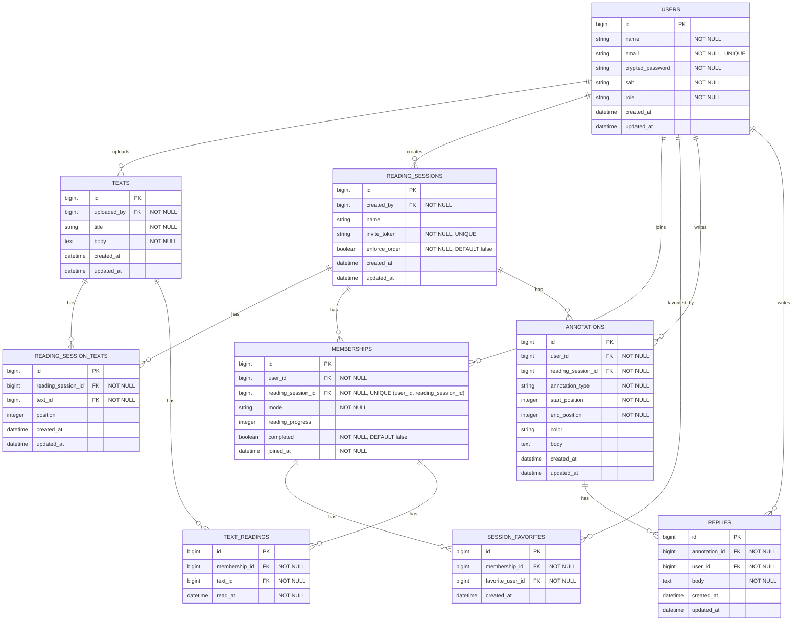

# [co-READER](https://github.com/QynToKey/co_reader)（day: 18）： 開発者ロール

## 0️⃣ 現状と実装方針

> 現状

管理者がメンバーのパスワードを変更できる。

> 実装方針

- なりすまし投稿などのリスクがあるため、パスワード変更機能を管理画面から削除する。
- `users.role` に `superadmin` を追加し、招待の発行者を追跡できるよう `invitations.invited_by_id` を追加する。

| コントローラー | 現状 | 変更後 |
| --- | --- | --- |
| `admin/invitations` | 全件 | `invited_by_id = current_user` |
| `admin/members` | 全 member | 自分のセッションの参加者のみ |
| `admin/reading_sessions` | 全件 | `created_by_id = current_user` |
| `admin/texts` | 全件 | `uploaded_by = current_user`（カラム既存） |

---

## 1️⃣ 管理者ビューからパスワード欄を削除

```erb
<%# app/views/admin/members/_form.html.erb %>
    <%= f.label :email, class: "form-label" %>
    <%= f.email_field :email, class: "form-control" %>
  </div>
-  <div class="mb-3">
-    <%= f.label :password, t("admin.members.form.password_hint"), class: "form-label" %>
-    <%= f.password_field :password, class: "form-control" %>
-  </div>
-  <div class="mb-3">
-    <%= f.label :password_confirmation, class: "form-label" %>
-    <%= f.password_field :password_confirmation, class: "form-control" %>
-  </div>
+
  <%= f.submit t("admin.members.form.submit"), class: "btn btn-primary" %>
  <%= link_to t("admin.members.form.cancel"), admin_members_path, class: "btn btn-secondary ms-2" %>
```

---

## 2️⃣ `Admin::MembersController` を修正

```ruby
# app/controllers/admin/members_controller.rb
  def update_params
-   params.require(:user).permit(:name, :email, :password, :password_confirmation).reject do |_, v|
-     v.blank? # パスワードが空の場合は、更新から除外する
+   params.require(:user).permit(:name, :email)
  end
```

👉 *`user_params`（`create` 用）はそのまま残す*

---

## 3️⃣ i18n から関連語彙を削除

```ruby
# config/locales/views/ja.yml
  admin:
      members:
        form:
  -       password_hint: "パスワード（変更する場合のみ入力）"
          submit: "保存する"
          cancel: "キャンセル"
```

---

## 4️⃣ `User` モデルの enum に `superadmin` を追加

```ruby
# app/models/user.rb
  enum :role, { member: 0, admin: 1, superadmin: 2 }
```

---

## 5️⃣ マイグレーション

```bash
$ docker compose exec web bin/rails g migration AddInvitedByIdToInvitations invited_by:references
      invoke  active_record
      create    db/migrate/20260425074642_add_invited_by_id_to_invitations.rb
```

  ⬇️

```ruby
# 20260425074642_add_invited_by_id_to_invitations.rb
class AddInvitedByIdToInvitations < ActiveRecord::Migration[8.1]
  def change
    add_reference :invitations, :invited_by, foreign_key: { to_table: :users }, null: true
  end
end
```

  ⬇️

```bash
$ docker compose exec web bin/rails db:migrate
== 20260425074642 AddInvitedByIdToInvitations: migrating ======================
-- add_reference(:invitations, :invited_by, {:foreign_key=>{:to_table=>:users}, :null=>true})
   -> 0.0591s
== 20260425074642 AddInvitedByIdToInvitations: migrated (0.0592s) =============
```

---

## 6️⃣ `Invitation` モデルに `invited_by` を追加

```ruby
# app/models/invitation.rb
 class Invitation < ApplicationRecord
+  belongs_to :invited_by, class_name: 'User', optional: true
   before_create :generate_token
```

---

## 7️⃣ `Admin::InvitationsController` を更新

```ruby
# app/controllers/admin/invitations_controller.rb
  def create
    Invitation.create!(invited_by: current_user) # 招待URLを発行する際に、現在のユーザーをinvited_byとして保存する
    redirect_to admin_invitations_path, notice: "招待URLを発行しました"
  end
```

---

## 8️⃣ `superadmin` に管理者権限を付与

```ruby
# app/controllers/application_controller.rb
  # 管理者権限が必要なアクションの前に呼び出されるメソッド
  def require_admin
    redirect_to root_path, alert: t("errors.not_authorized") unless current_user&.admin? || current_user&.superadmin?
  end
```

```ruby
# app/views/shared/_header.html.erb
<% if current_user&.admin? || current_user&.superadmin? %>
```

---

## 9️⃣ ER 図を更新

- エンティティ一覧に `invitations` を追加
- `users` の責務説明を `member`・`admin`・`superadmin` の3種類に更新
- `invitations` の責務説明を追加
- リレーション整理に `user` は 0以上の `invitations` を発行できる を追加
- Mermaid 図に `INVITATIONS` エンティティと `USERS ||--o{ INVITATIONS : issues` を追加
- `USERS.role` を `"NOT NULL (member/admin/superadmin)"` に更新



---

### 総学習時間： 1256.5 時間
