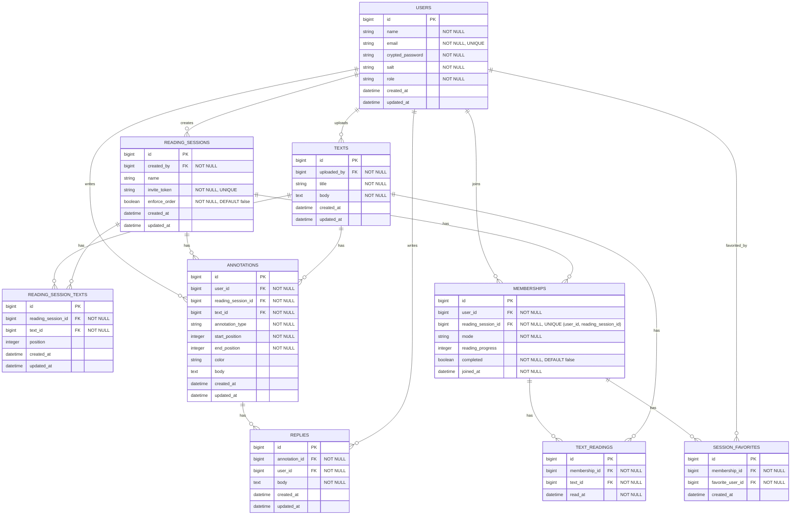

# [co-READER](https://github.com/QynToKey/co_reader)（day: 22_1）： 書き込みモデル設計

---

## 0️⃣ 実装方針

- コア機能の土台となる `Annotation` モデルを設計・実装する。
- ER 図では `text_id` が抜けていたため、今回の実装に合わせて ER 図も修正する。
- 合わせて `texts/show.html.erb` のハードコード文字列を i18n 化する。

---

## 1️⃣ ER 図の修正

👉 *`text_id` を追加*



---

## 2️⃣ マイグレーション

👉 *`annotations` テーブルを作成

```bash
$ docker compose exec web bin/rails g migration CreateAnnotations
      invoke  active_record
      create    db/migrate/20260429004313_create_annotations.rb
```

  ⬇️

```ruby
# db/migrate/20260429004313_create_annotations.rb
class CreateAnnotations < ActiveRecord::Migration[8.0]
  def change
    create_table :annotations do |t|
      t.references :user,            null: false, foreign_key: true
      t.references :reading_session, null: false, foreign_key: true
      t.references :text,            null: false, foreign_key: true
      t.integer    :annotation_type, null: false
      t.integer    :start_position,  null: false
      t.integer    :end_position,    null: false
      t.string     :color
      t.text       :body

      t.timestamps
    end
  end
end
```

  ⬇️

```bash
$ docker compose exec web bin/rails db:migrate
== 20260429004313 CreateAnnotations: migrating ================================
-- create_table(:annotations)
   -> 0.0458s
== 20260429004313 CreateAnnotations: migrated (0.0459s) =======================
```

---

## 3️⃣ `Annotation` モデルを作成

```bash
touch app/models/annotation.rb
```

```ruby
# app/models/annotation.rb
class Annotation < ApplicationRecord
  belongs_to :user
  belongs_to :reading_session
  belongs_to :text

  enum :annotation_type, { highlight: 0, underline: 1, comment: 2 }

  validates :annotation_type, presence: true
  validates :start_position,  presence: true
  validates :end_position,    presence: true
end
```

---

## 4️⃣ 関連モデルにアソシエーション追加

### `User` モデル

```ruby
# app/models/user.rb
has_many :annotations, dependent: :destroy
```

### `ReadingSession` モデル

```ruby
# app/models/reading_session.rb
has_many :annotations, dependent: :destroy
```

### `Text` モデル

```ruby
# app/models/text.rb
has_many :annotations, dependent: :destroy
```

---

## 5️⃣ `ja.yml` の修正

```ruby
# config/locales/views/ja.yml
+  texts:
+    show:
+      completed: "読了"
+      mark_as_read: "読了にする"
  profiles:
    show:
-      not_completed: "読了にする"
```

---

## 6️⃣ 読了ボタンを i18n 化

```erb
<%# app/views/texts/show.html.erb %>
      <span class="btn btn-success disabled"><i class="bi bi-check-lg"></i> <%= t("texts.show.completed") %></span>
    <% else %>
      <%= button_to t("texts.show.mark_as_read"), reading_session_text_text_reading_path(@reading_session, @text), class: "btn btn-outline-success" %>
```

---

### 動作確認

- [x] `docker compose exec web rails db:migrate` が正常終了する
- [x] `docker compose exec web rails console` で以下を実行：

```bash
Annotation.new(annotation_type: :highlight).annotation_type
# => "highlight"
```

- [x] ブラウザでテキスト詳細を開き「読了にする」ボタンが正常に表示・動作する

---

#### 総学習時間： 1272.9 時間
