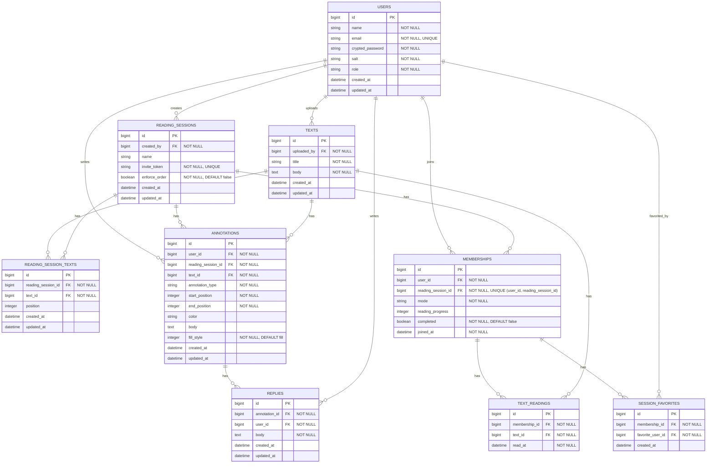

# [co-READER](https://github.com/QynToKey/co_reader)（day: 24）： ポップアップに fill / outline トグルを追加

## 0️⃣ 背景と実装方針

> 背景

括弧・角括弧などの代替として、背景色なし・枠線のみのアウトライン表示を提供したい。

> 実装方針

新規型を増やすとツールバーが肥大化するため、既存のハイライト型の属性として実装する。

> 実装内容

- ポップアップ内に `fill` / `outline` のトグルを設置
  - `fill`: 現在の塗りつぶしハイライト（デフォルト）
  - `outline`: 背景なし・枠線のみ
- アノテーション作成後のポップアップおよび既存アノテーション選択時のポップアップ、両方で利用可能にする

> ER 図を更新



---

## 1️⃣ `annotation` テーブルに `fill_style` カラムを追加

```bash
$ docker compose exec web bin/rails g migration AddFillStyleToAnnotations fill_style:integer
      invoke  active_record
      create    db/migrate/20260502120929_add_fill_style_to_annotations.rb
```

  ⬇️

```ruby
# 20260502120929_add_fill_style_to_annotations.rb
class AddFillStyleToAnnotations < ActiveRecord::Migration[8.1]
  def change
    add_column :annotations, :fill_style, :integer, default: 0, null: false
  end
end
```

  ⬇️

```bash
$ docker compose exec web bin/rails db:migrate
== 20260502120929 AddFillStyleToAnnotations: migrating ========================
-- add_column(:annotations, :fill_style, :integer, {:default=>0, :null=>false})
   -> 0.0098s
== 20260502120929 AddFillStyleToAnnotations: migrated (0.0099s) ===============
```

---

## 2️⃣ `Annotation` モデルに `fill_style` を追加

```ruby
# app/models/annotation.rb
  enum :fill_style, { fill: 0, outline: 1 }
```

---

## 3️⃣ `AnnotationsController` に `fill_style` を追加

```ruby
# app/controllers/annotations_controller.rb
      render json: {
        id:              annotation.id,
        annotation_type: annotation.annotation_type,
        start_position:  annotation.start_position,
        end_position:    annotation.end_position,
        color:           annotation.color,
+       fill_style:      annotation.fill_style
      }, status: :created
     else
       render json: { errors: annotation.errors.full_messages }, status: :unprocessable_entity

  ・・・

   def annotation_params
-    params.require(:annotation).permit(:start_position, :end_position, :annotation_type, :color)
+    params.require(:annotation).permit(:start_position, :end_position, :annotation_type, :color, :fill_style)
   end
```

---

## 4️⃣ CSS に `.annotation-highlight.outline` を追加

```css
/* app/assets/stylesheets/application.css */
.annotation-highlight.outline {
  background-color: transparent;
  border: 2px solid;
  border-radius: 2px;
  padding: 0 1px;
}
```

---

## 5️⃣ 「テキスト詳細」ビューにトグルボタンを追加

```erb
<%# app/views/texts/show.html.erb %>
        data-text-selection-annotations-value="<%= @annotations.map { |a|
          { id: a.id, annotation_type: a.annotation_type,
            start_position: a.start_position, end_position: a.end_position,
-           color: a.color }
+           color: a.color, fill_style: a.fill_style }
        }.to_json %>">

     ・・・
               class="btn btn-sm btn-info me-1">
         <%= t("texts.show.annotations.toolbar.underline") %>
       </button>
+      <button data-popup-action="variant" data-variant="fill"
+        class="btn btn-sm btn-secondary me-1"><%= t("texts.show.annotations.fill_style.fill") %></button>
+      <button data-popup-action="variant" data-variant="outline"
+        class="btn btn-sm btn-secondary me-1"><%= t("texts.show.annotations.fill_style.outline") %></button>
       <button data-popup-action="delete"
               class="btn btn-sm btn-danger">
```

```ruby
# config/locales/views/ja.yml
      annotations:
        toolbar:
          highlight: "ハイライト"
          underline: "アンダーライン"
        create:
          success: "書き込みを保存しました"
          error: "保存に失敗しました"
+       fill_style:
+         fill: "塗り"
+         outline: "枠線"
        delete: "削除"
```

---

## 6️⃣ `text_selection_controller.js` を更新

### `#renderAnnotation` — `data-fill-style` / `data-color` の追加と outline 描画

```javascript
span.dataset.fillStyle  = annotation.fill_style ?? "fill"
span.dataset.color      = annotation.color ?? ""
```

```javascript
if (annotation.color) {
  if (annotation.annotation_type === "highlight") {
    if (annotation.fill_style === "outline") {
      span.classList.add("outline")
      span.style.backgroundColor = "transparent"
      span.style.borderColor     = annotation.color
    } else {
      span.style.backgroundColor = annotation.color
    }
  } else {
    span.style.borderBottomColor = underlineColor(annotation.color)
  }
}
```

### `selectColor` — ツールバーからの PATCH（色変更）で highlight の outline を考慮

👉 *PATCH 成功後のスタイル更新部分（`span.style.backgroundColor = ""` から始まるブロック）を置き換え*

```javascript
span.style.backgroundColor   = ""
span.style.borderBottomColor = ""
span.style.borderColor       = ""
if (type === "highlight") {
  span.dataset.color = color
  this.#applyFillStyle(span)
} else {
  span.style.borderBottomColor = underlineColor(color)
}
```

### `#handlePopupClick` — type ボタン後に variant ボタンを同期

```javascript
this.#syncVariantButtons()
```

### `#handlePopupClick` — popup からの色変更（PATCH）で highlight の outline を考慮

```javascript
span.style.backgroundColor   = ""
span.style.borderBottomColor = ""
span.style.borderColor       = ""
if (type === "highlight") {
  span.dataset.color = color
  this.#applyFillStyle(span)
} else {
  span.style.borderBottomColor = underlineColor(color)
}
```

### `#handlePopupClick` — delete 後に variant ボタンをリセット

```javascript
this.#syncVariantButtons()
```

### `#handlePopupClick` — variant アクションを追加

```javascript
} else if (action === "variant") {
  // HL 選択中以外は無視する
  if (this.#focusedType !== "highlight") return
  const span = this.#activeAnnotations["highlight"]
  if (!span) return

  const variant = btn.dataset.variant
  const id = span.dataset.annotationId
  fetch(`${this.deleteBaseUrlValue}${id}`, {
    method: "PATCH",
    headers: { "Content-Type": "application/json", "X-CSRF-Token": token },
    body: JSON.stringify({ annotation: { fill_style: variant } })
  })
  .then(res => {
    if (res.ok) {
      span.dataset.fillStyle = variant
      this.#applyFillStyle(span)
      this.#syncVariantButtons()
    }
  })
```

### `#handleClick` — ポップアップ表示時に variant ボタンをリセット

```javascript
this.#syncVariantButtons()
```

### `#handleMouseup` — ドラッグで covered 判定のポップアップ表示時に variant ボタンをリセット

```javascript
this.#syncVariantButtons()
```

### `#showPopupForAnnotations` — ポップアップ切り替え時に variant ボタンをリセット

```javascript
this.#syncVariantButtons()
```

### 新メソッド2つを追加

```javascript
// fill/outline をスパンのインラインスタイルに反映する
// span.dataset.fillStyle と span.dataset.color を参照するため、両データ属性を最新の値に更新してから呼ぶこと
#applyFillStyle(span) {
  const color = span.dataset.color
  span.style.backgroundColor = ""
  span.style.borderColor     = ""
  span.classList.remove("outline")
  if (span.dataset.fillStyle === "outline") {
    span.classList.add("outline")
    span.style.backgroundColor = "transparent"
    if (color) span.style.borderColor = color
  } else {
    if (color) span.style.backgroundColor = color
  }
}

// variant ボタン（塗り／枠線）のアクティブ状態を現在の focusedType と span の fill_style に合わせて同期する
// HL が選択中かつ HL スパンが存在するときのみいずれかのボタンをアクティブにし、それ以外は全ボタンを非アクティブにする
#syncVariantButtons() {
  const hlSpan = this.#activeAnnotations["highlight"]
  const currentVariant = hlSpan?.dataset.fillStyle ?? "fill"
  const isHighlight = this.#focusedType === "highlight"
  this.editPopupTarget.querySelectorAll("[data-popup-action='variant']").forEach(btn => {
    const isActive = isHighlight && btn.dataset.variant === currentVariant
    btn.classList.toggle("active", isActive)
    btn.style.boxShadow = isActive ? "0 0 0 3px white" : ""
  })
}
```

---

#### 総学習時間： 1289.1 時間
