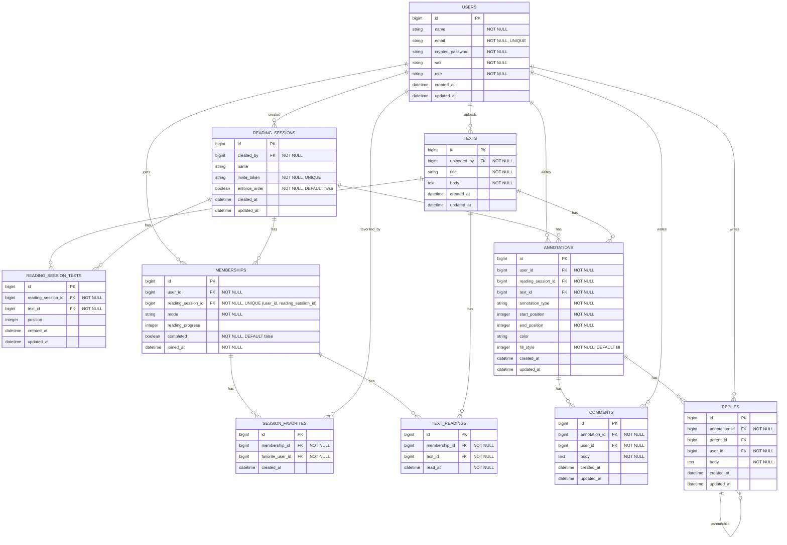

# [co-READER](https://github.com/QynToKey/co_reader)（day: 25_2）： Comment モデルの実装

## 設計方針

- コメント（`comments`）は個人の読書メモ、返信（`replies`）は共読における対話として役割を明確に分離する。
  - `replies` は `annotation_id` で書き込みに紐づき、`parent_id`（自己参照）でスレッドを形成する。
  - コメントのないアノテーション（HL/UL のみ）に対しても直接 reply できる。
- コメントは書き込み（HL/UL）に紐づく形で管理する。共読モードでは他ユーザーが書き込みへ reply を重ねることで「交わし合い」が生まれる
  - `replies` は共読モード専用の操作だが、`annotation_id` で書き込みに直接紐づけることで、孤読中に作成した書き込みに後から共読モードで reply を重ねられる設計を維持する。

```text
annotation (HL/UL)
  ├── comment  ← 個人メモ。孤読中に書く。スレッドではない
  └── reply              ← ← スレッド発生
        └── reply (parent_id あり)
              └── reply (parent_id あり)
                    └── ...
```

### ER 図



---

## 実装

### 1️⃣ `annotations` テーブルから不要カラムを削除

#### マイグレーション

```bash
$ docker compose exec web bin/rails g migration RemoveBodyFromAnnotations
      invoke  active_record
      create    db/migrate/20260503023755_remove_body_from_annotations.rb
```

⬇️

```ruby
# 20260503023755_remove_body_from_annotations.rb
class RemoveBodyFromAnnotations < ActiveRecord::Migration[8.0]
  def change
    remove_column :annotations, :body, :text
  end
end
```

  ⬇️

```bash
$ docker compose exec web bin/rails db:migrate
== 20260503023755 RemoveBodyFromAnnotations: migrating ========================
-- remove_column(:annotations, :body, :text)
   -> 0.0157s
== 20260503023755 RemoveBodyFromAnnotations: migrated (0.0158s) ===============
```

#### `Annotation' モデルの修正

```ruby
# app/models/annotation.rb
-  enum :annotation_type, { highlight: 0, underline: 1, comment: 2 }
+  enum :annotation_type, { highlight: 0, underline: 1 }
```

---

### 2️⃣ `Comment` モデル / `Comments` テーブルを作成

>モデル

```bash
touch app/models/comment.rb
```

```ruby
# app/models/comment.rb
class CreateComments < ActiveRecord::Migration[8.0]
  def change
    create_table :comments do |t|
      t.references :annotation, null: false, foreign_key: true
      t.references :user,       null: false, foreign_key: true
      t.text       :body,       null: false
      t.timestamps
    end
  end
end
```

> テーブル

```bash
$ docker compose exec web bin/rails g migration CreateComments
      invoke  active_record
      create    db/migrate/20260503030032_create_comments.rb
```

  ⬇️

```ruby
# db/migrate/20260503030032_create_comments.rb
class CreateComments < ActiveRecord::Migration[8.0]
  def change
    create_table :comments do |t|
      t.references :annotation, null: false, foreign_key: true
      t.references :user,       null: false, foreign_key: true
      t.text       :body,       null: false

      t.timestamps
    end
  end
end
```

  ⬇️

```bash
$ docker compose exec web bin/rails db:migrate
== 20260503030032 CreateComments: migrating ===================================
-- create_table(:comments)
   -> 0.0518s
== 20260503030032 CreateComments: migrated (0.0519s) ==========================
```

---

### 3️⃣ Annotation モデルにアソシエーション追加

```ruby
# app/models/annotation.rb
has_many :comments, dependent: :destroy
```

---

### 4️⃣ ルーティング に `comments` を追加

```ruby
# config/routes.rb
-  resources :annotations, only: %i[ update destroy ]
+  resources :annotations, only: %i[ update destroy ] do
+    resources :comments, only: %i [ create destroy ]
+  end
```

  ⬇️ 確認

```bash
$ docker compose exec web bin/rails routes | grep comments
    annotation_comments POST   /annotations/:annotation_id/comments(.:format)                                                    comments#create
    annotation_comment DELETE /annotations/:annotation_id/comments/:id(.:format)                                                comments#destroy
```

---

### 5️⃣ `CommentsController` を作成

```bash
touch app/controllers/comments_controller.rb
```

```ruby
# app/controllers/comments_controller.rb
class CommentsController < ApplicationController
  before_action :require_login
  before_action :set_annotation

  def create
    comment = @annotation.comments.build(comment_params)
    comment.user = current_user
    if comment.save
      render json: { id: comment.id, body: comment.body }, status: :created
    else
      render json: { errors: comment.errors.full_messages }, status: :unprocessable_entity
    end
  end

  def destroy
    comment = @annotation.comments.find(params[:id])
    if comment.user == current_user
      comment.destroy
      render json: {}, status: :ok
    else
      render json: { error: "Not found" }, status: :not_found
    end
  rescue ActiveRecord::RecordNotFound
    render json: { error: "Not found" }, status: :not_found
  end

  private

  def set_annotation
    # current_user.annotations でスコープを絞り、他ユーザーの annotation への不正操作を防ぐ
    @annotation = current_user.annotations.find(params[:annotation_id])
  rescue ActiveRecord::RecordNotFound
    render json: { error: "Not found" }, status: :not_found
  end

  def comment_params
    params.require(:comment).permit(:body)
  end
end
```

---

### 6️⃣ 「投稿フォーム」ビューを作成

> i18n に関連語彙を追加

```ruby
# config/locales/views/ja.yml
+        comment:
+          toggle: "コメント"
+          placeholder: "メモを書く..."
+          submit: "保存"
+          cancel: "キャンセル"
```

> ポップアップに「コメント投稿ボタン」を追加

```erb
<%# app/views/texts/show.html.erb %>

   <div data-controller="text-selection"
        data-text-selection-url-value="<%= reading_session_text_annotations_path(@reading_session, @text) %>"
        data-text-selection-delete-base-url-value="/annotations/"
+       data-text-selection-comment-base-url-value="/annotations/"
        data-text-selection-annotations-value="<%= @annotations.map { |a|
          { id: a.id, annotation_type: a.annotation_type,
              start_position: a.start_position, end_position: a.end_position,
              color: a.color, fill_style: a.fill_style }
          }.to_json %>">

        ・・・

       <button data-popup-action="variant" data-variant="outline"
         class="btn btn-sm btn-secondary me-3"><%= t("texts.show.annotations.fill_style.outline") %></button>
+      <button data-popup-action="comment-toggle"
+        class="btn btn-sm btn-outline-light me-3">
+        <%= t("texts.show.annotations.comment.toggle") %>
+      </button>
       <button data-popup-action="delete"
               class="btn btn-sm btn-danger">
         <%= t("texts.show.annotations.delete") %>
       </button>
+
+      <div data-text-selection-target="commentForm"
+          class="d-none mt-2"
+          style="white-space: normal; min-width: 220px;">
+        <textarea data-text-selection-target="commentBody"
+                  class="form-control form-control-sm"
+                  rows="3"
+                  placeholder="<%= t("texts.show.annotations.comment.placeholder") %>"></textarea>
+        <div class="mt-1 d-flex gap-1 justify-content-end">
+          <button data-popup-action="comment-submit"
+                  class="btn btn-sm btn-primary">
+            <%= t("texts.show.annotations.comment.submit") %>
+          </button>
+          <button data-popup-action="comment-cancel"
+                  class="btn btn-sm btn-secondary">
+            <%= t("texts.show.annotations.comment.cancel") %>
+          </button>
+        </div>
+      </div>
     </div>
```

---

### 7️⃣ `text_selection_controller.js` を更新

- `static targets` に `"commentForm"`, `"commentBody"` を追加

```js
static targets = ["body", "toolbar", "editPopup", "commentForm", "commentBody"]
```

- `static values` に `commentBaseUrl: String` を追加

```js
static values = { url: String, annotations: Array, deleteBaseUrl: String, commentBaseUrl: String }
```

- `#handlePopupClick` に `comment-toggle` / `comment-submit` / `comment-cancel` の分岐を追加

```js
    } else if (action === "comment-toggle") {
      // コメントフォームの表示・非表示を切り替える
      this.commentFormTarget.classList.toggle("d-none")
      if (!this.commentFormTarget.classList.contains("d-none")) {
        this.commentBodyTarget.focus()
      }

    } else if (action === "comment-cancel") {
      this.commentFormTarget.classList.add("d-none")
      this.commentBodyTarget.value = ""

    } else if (action === "comment-submit") {
      // 型が選択されており、かつその annotation が存在することが前提
      if (!this.#focusedType) return
      const span = this.#activeAnnotations[this.#focusedType]
      if (!span) return

      const body = this.commentBodyTarget.value.trim()
      if (!body) return

      const annotationId = span.dataset.annotationId
      fetch(`${this.commentBaseUrlValue}${annotationId}/comments`, {
        method: "POST",
        headers: { "Content-Type": "application/json", "X-CSRF-Token": token },
        body: JSON.stringify({ comment: { body } })
      })
      .then(res => res.json())
      .then(data => {
        if (data.id) {
          this.commentBodyTarget.value = ""
          this.commentFormTarget.classList.add("d-none")
        }
      })
    }
```

- `#hideEditPopup` にコメントフォームのリセット処理を追加

```js
  #hideEditPopup() {
    this.editPopupTarget.classList.add("d-none")
    this.#activeAnnotations = {}
    this.#focusedType = null
    this.#editStart   = null
    this.#editEnd     = null
    // コメントフォームを閉じてリセットする
    this.commentFormTarget.classList.add("d-none")
    this.commentBodyTarget.value = ""
  }
```

---

#### 動作確認

- [x] アノテーションをクリック → 型選択 → 「コメント」ボタンでフォーム表示
- [x] テキスト入力 → 「保存」で DB に記録されることを確認（`Comment.last` で検証済み）
- [x] 「キャンセル」で入力破棄・フォームを閉じることを確認
- [x] ポップアップ外クリックでフォームがリセットされることを確認

---

##### 総学習時間： 1293.6 時間
