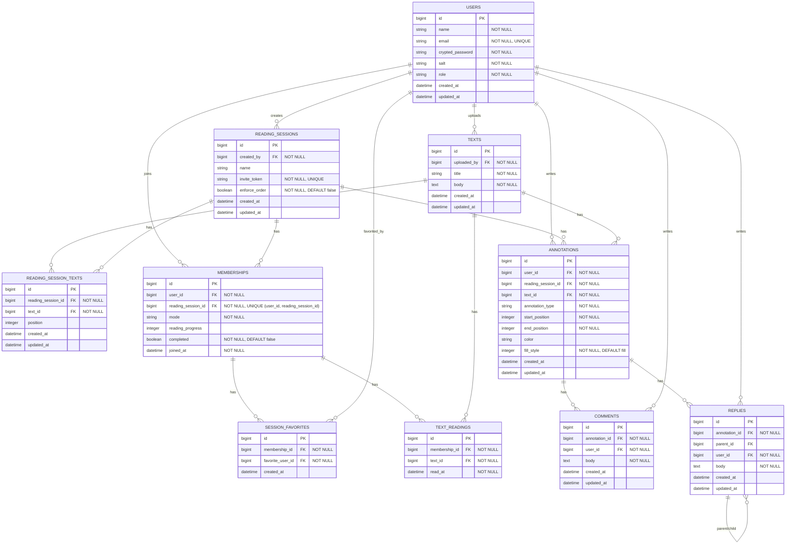

# [co-READER](https://github.com/QynToKey/co_reader)（day: 25_2）： Comment モデルの実装

## 設計方針

- コメント（`comments`）は個人の読書メモ、返信（`replies`）は共読における対話として役割を明確に分離する。
  - `replies` は `annotation_id` で書き込みに紐づき、`parent_id`（自己参照）でスレッドを形成する。
  - コメントのないアノテーション（HL/UL のみ）に対しても直接 reply できる。
- コメントは書き込み（HL/UL）に紐づく形で管理する。共読モードでは他ユーザーが書き込みへ reply を重ねることで「交わし合い」が生まれる

```text
annotation (HL/UL)
  ├── comment  ← 個人メモ。孤読中に書く。スレッドではない
  └── reply              ← ← スレッド発生
        └── reply (parent_id あり)
              └── reply (parent_id あり)
                    └── ...
```

### ER 図



---
